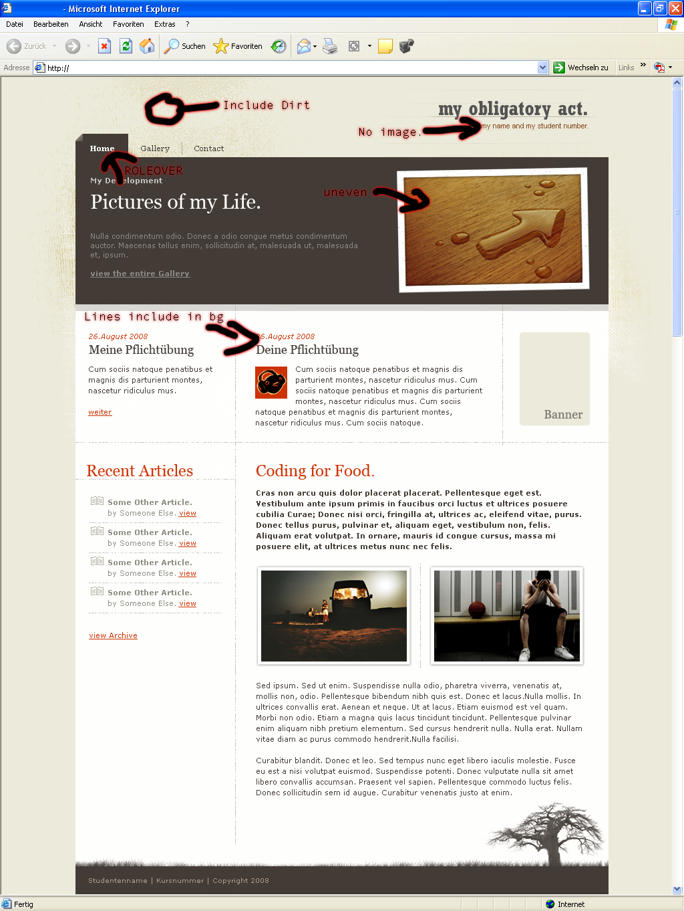

034_alte_htmlcss_pue
========
Screendesign einer Startseite umsetzen (Alte HTML/CSS Pflichtübung)

### Angabe:

Teil 1:

Erstelle eine HTML-Datei für das PSD-Bild. Der Inhalt soll mit semantisch richtigen Tags ausgezeichnet sein. Der Code muss noch keine IDs oder Klassen beinhalten, auch Markup, das nur für das Layout gebraucht wird (divs, spans) können noch fehlen. Die Seite soll keine Tables enthalten. Alle Links sind leer ("#"). Alle Inhalte (Text, Bilder) müssen aus dem PS-File entnommen werden. ACHTUNG: Beide Bilder im Langtext sollen im HTML ohne Rahmen dargestellt werden. Dieser wird dann in PUE #2 mittels CSS hinzugefügt.

Wichtig ist, dass alle Inhalte semantisch korrekt vorhanden sind und dass eine Validierung zu keinen Fehlern führt. Auch die Ordnerstruktur wird überprüft.

Teil 2:

Vervollständige die HTML-Datei aus Übung #1 mittels CSS, sodass sie dem PS-Entwurf entspricht. Der gesamte CSS-Code muss dabei in einer externen Datei stehen. Alle Bauteile für die Seite müsst Ihr wieder dem PS-Dokument entnehmen. Abgesehen von der Seitenüberschrift (my obligatory act) kann für alle restlichen Überschriften HTML-Text verwendet werden (Verdana und Georgia). Das Hauptmenü soll bei hover Karteireiter anzeigen (so wie im PSD-File bei "Home"). Alle weiteren Links sollen mit Unterstrich dargestellt werden, bei Rollover soll dieser verschwinden. Die beiden Bilder im Langtext sollen im HTML ohne Rahmen dargestellt werden. Der Rahmen soll für diese mittels CSS-Klasse hinzugefügt werden. Im Seitentitel und in der Fusszeile sind Namen und Studentennummer hinzuzufügen.

ACHTUNG: Nicht übersehen: Im oberen Bereich der Seite befinden sich Dreckspritzer neben dem Layout. Der Seitentitel ist mit schwach gezeichneten Linien hinterlegt.

Die Seite muss auf allen modernen und populären Browsern (Chrome, FF, IE, Safari) laufen und haargenau der PS-Vorlage entsprechen.

PS: Lösung gibt es aktuell noch keine.

