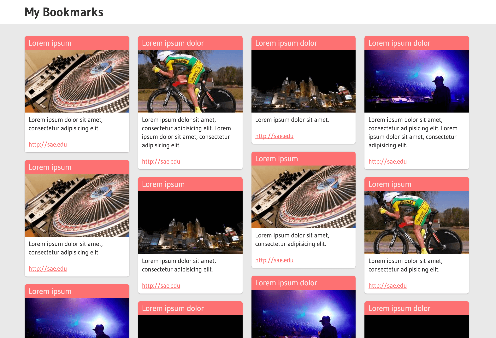

035_testvorbereitung
========
Testvorbereitung Test 2

### Vorgabe:

In insgesamt vier Spalten (`.col`) befinden sich eine Reihe von Artikeln. Die Spalten sollen nebeneinander dargestellt und die Artikel gestyled werden.

### Angabe:

Alle Bereiche, in denen etwas zu tun ist, sind mit `TODO:` ausgezeichnet. 

Das Stylesheet im vorgegebenen HTML-Dokument (vorgabe.html) soll so angepasst werden, dass es aussieht wie in der Vorlage.

Alle Änderungen sind in css/vorgabe.css vorzunehmen.  
Der Aufbau des Markup darf nicht verändert werden.