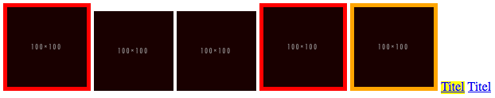

026_attributselektoren
========
Attributselektoren

### Angabe:

Verwende Attributselektoren:

* Alle Bilder ohne `alt`-Attribut sollen einen roten 10px Rahmen bekommen. 
* Alle Bilder mit leerem `alt`-Attribut (alt="") sollen einen orangen 10px Rahmen bekommen. 
* Alle Links mit https-Pfaden sollen einen gelben Hintergrund bekommen.

