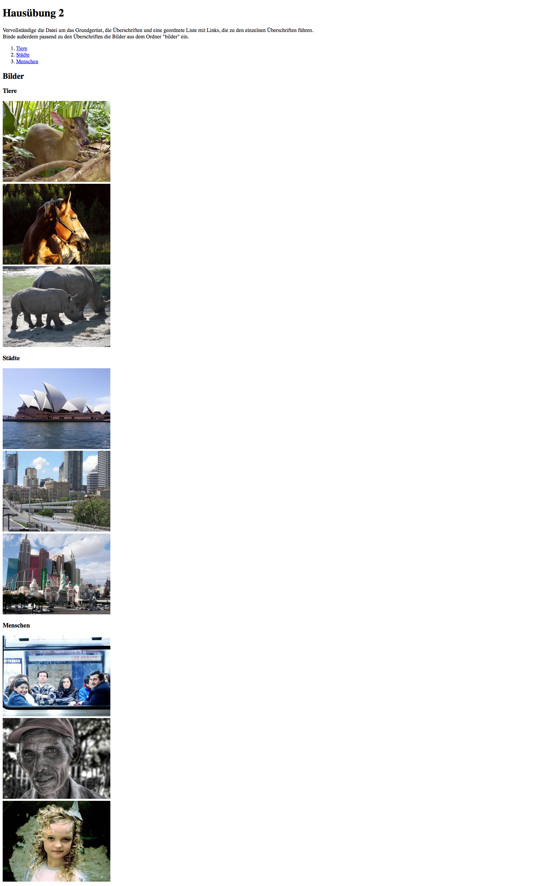

002_ankerpfade
========
HTML-Grundgerüst aufbauen, Anker definieren + Bilder einbinden

### Angabe:

Vervollständige die Datei [vorgabe.html](vorgabe.html) um das Grundgerüst, die Überschriften, etwaige Container (header, main, etc.) und eine geordnete Liste mit Links, die zu den einzelnen Überschriften führen.
Binde außerdem passend zu den Überschriften die Bilder aus dem Ordner "bilder" ein.

Das Dokument soll am Ende so aussehen:

