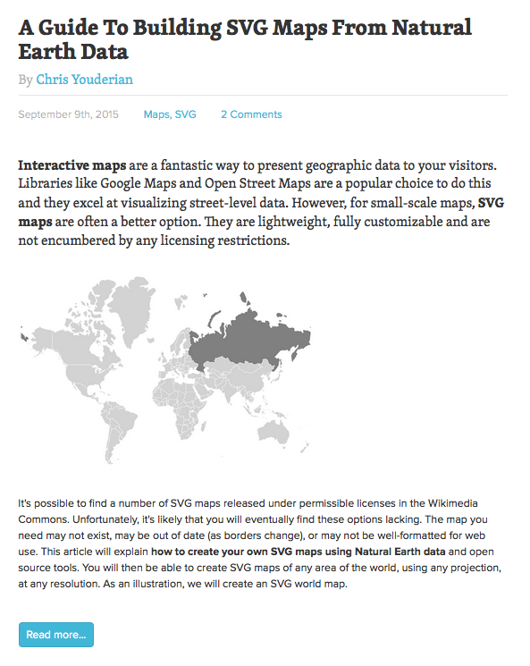

003_blogpost_htmlstruktur
========
HTML-Struktur für einen Blogpost skizzieren

### Angabe:

Zeichne die HTML-Struktur [dieses Blogposts](blogpost.png) auf Papier auf. Überlege so genau wie möglich, wie der Post strukturiert ist und aus welchen Kindelementen er besteht.

