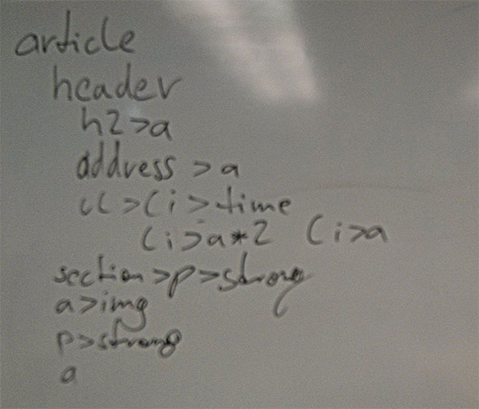

004_blogpost_projekt_markup
========
Projekt für den Blogpost anlegen und HTML schreiben

### Angabe:

Nachdem du die HTML-Struktur [dieses Blogposts](blogpost.png) bereits auf [Papier skizziert](003_blogpost_htmlstruktur) hast, lege einen Projektordner an und übertrage den Inhalt deiner Skizze in HTML.

