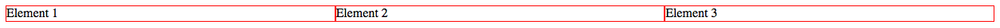

017_flexbox_gleiche_spalten
========
Gleich breite Spalten mit Flexbox

### Angabe:

Positioniere die `li`s nebeneinander, sodass sie nicht nur in einer Zeile sind, sondern auch immer gleich breit. Dabei soll es egal sein wie viele Elemente es am Ende sind. Wenn also ein `li` dazu kommt, sollten sie immer noch alle in einer Zeile und gleich breit sein, ohne das im CSS etwas geändert werden muss.

