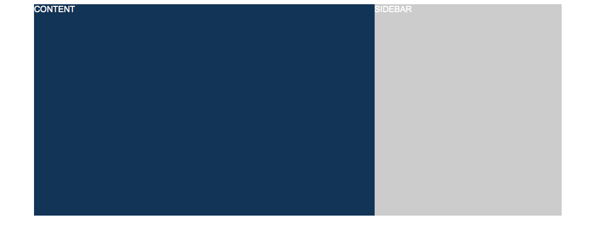

018_flexbox_layout_2spalten
========
2-spaltiges Layout mit Flexbox

### Angabe:

Baue das Layout nach, wie es in der Vorgabe zu sehen ist. Der zur Verfügung stehende Platz soll zu 2/3 auf die `section` und zu 1/3 auf das `aside` aufgeteilt werdens.

