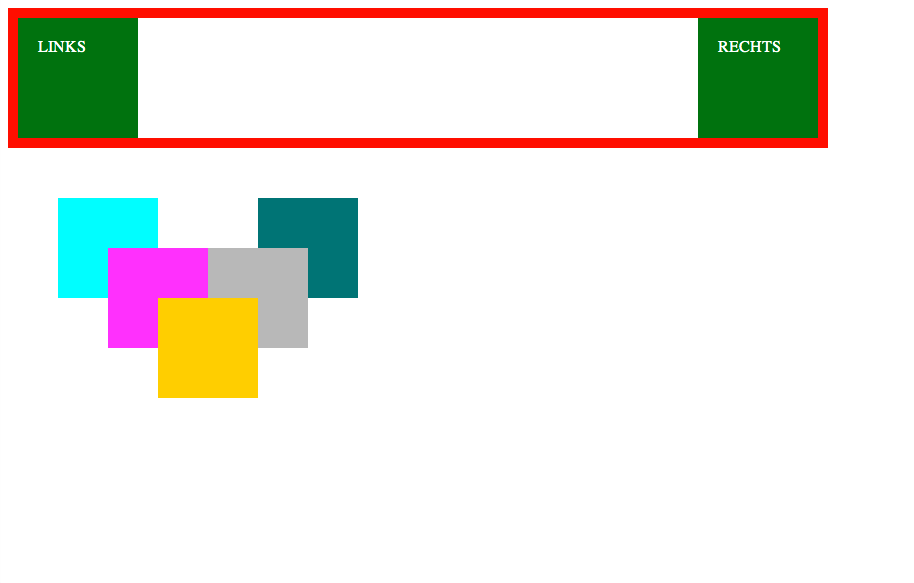

021_position
========
Position absolute und relative

### Angabe:

Positioniere alle Elemente so, wie sie in der Vorgabe (vorgabe.png) zu sehen sind. Nutze dafür position: relative und/oder position: absolute.

