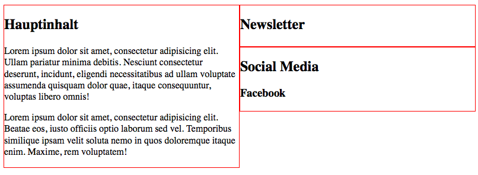
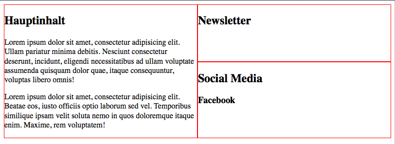

029_flexbox_3elemente2spalten
========
2 Spalten - 1. 1 Element, 2. 2 Elemente untereinander

### Angabe:

Baue das Layout wie in der [Vorgabe](vorgabe1.png) zu sehen nach.

**Zusatzaufgabe:**

Die beiden `aside`-Elemente sollen sich an die Höhe der `section` anpassen in dem sie den vertikal zur Verfügung stehenden Inhalt gleichmäßig aufteilen.

**Zusatzaufgabe:**

Die beiden `aside` Element sollen zusätzlich auch gleich hoch sein.