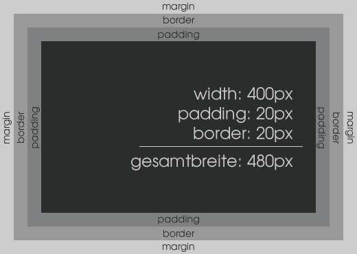

# Box-Modell

`padding` und `border` werden zur `width` dazu gerechnet.



Tatsächliche Breite: `width` + `padding` + `border`  
Tatsächliche Höhe: `height` + `padding` + `border`

## Alternatives Box-Modell

```
div {
  box-sizing: border-box;
}
```

**content-box**: Standardwert. Die tatsächliche Breite/Höhe setzt sich zusammen aus: width bzw. height, padding und border.

**padding-box**: 
`padding` und `border` werden in die `width` eingerechnet. Tatsächliche Breite: `width` / Tatsächliche Höhe: `height`

Mehr über box-sizing auf <http://cssreference.io/box-model/#box-sizing>


## width

Breite eines Elements.  
Die Breite eines Elements kann mit relativen oder absoluten Zahl- oder Prozentwerten (Prozentwerte beziehen sich auf die Breite des Elternelements) definiert werden. Der Standartwert für die Breite eines Elements ist ‘auto’. width kann nur auf Blocklevelelemente angewendet werden.

```
div {
  width: 80%;
}
```

Mindestbreite eines Elements.

```
div {
  min-width: 200px;
}
```

Maximalbreite eines Elements.

```
div {
  max-width: 600px;
}
```

## height

Höhe eines Elements.

```
div {
  height: 500px;
}
```

Auch `min-height` und `max-height` (siehe `width`).

## padding

Innenabstand in einem Element.

```
  div {
    padding-top: 50px;
    padding-right: 20px;
    padding-bottom: 10px;
    padding-left: 4px;
  }
```

### Alle Seiten

`padding: 30px;`

### Oben - Unten

`padding: 20px 10px;`

### Oben - Links/Rechts - Unten

`padding: 20px 5px 10px;`

### Oben - Rechts - Unten - Links

`padding: 20px 40px 5px 10px;`


Mehr über padding auf <http://cssreference.io/box-model/#padding>

## border

Form: `border-style` z.B. (`solid`, `dotted`, `dashed`)  
Stärke: `border-width`  
Farbe: `border-color`

Jeweils 1 - 4 Werte möglich. (wie bei `padding` und `margin`)

```
ul {
  border-style: solid;
  border-color: blue red;
  border-width: 30px 20px 10px;
}
```

Seiten können auch separat angesprochen werden:

```
li {
  border-top-color: blue;
  border-left-width: 10px;
  border-bottom-style: dotted;
}
```

Kurzschreibweise: `border`;

```
div {
  border: 10px solid #FF00FF;
  border-top: 5px solid green;
}
``` 

Mehr über border auf <http://cssreference.io/box-model/#border-bottom-width>

## margin

Außenabstand eines Elements.

```
  div {
    margin-top: 50px;
    margin-right: 20px;
    margin-bottom: 10px;
    margin-left: 4px;
  }
```

Kurschreibweise und einzelne Seiten wie bei `padding`. 

